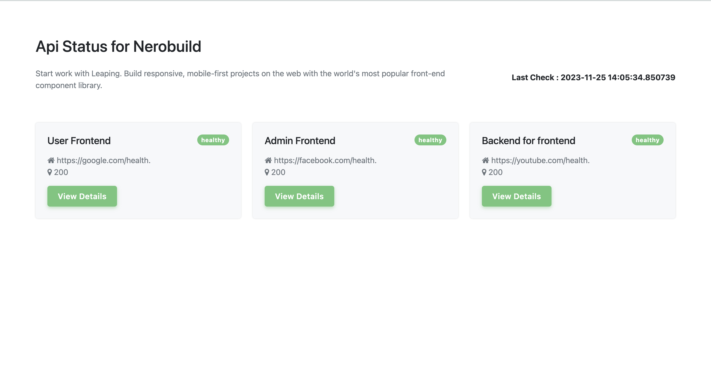

# API Status Maker

[](https://github.com/zeninzone/api-status-maker/actions)
[](https://opensource.org/licenses/MIT)
[](https://www.python.org/downloads/)
[](https://hub.docker.com/r/alsaheem/api-status-checker)
[](https://kubernetes.io/)

A powerful API monitoring tool that helps you track the health of your microservices and provides a beautiful status page. This application offers real-time monitoring, historical data tracking, and multiple alerting mechanisms.




*Dashboard showing API statuses with both successful (green) and failed (red) endpoints*

## Features

- Real-time API health monitoring
- Response time tracking and statistics
- Historical data visualization
- Multiple alerting channels (Email, Slack, Discord)
- Customizable themes (Light, Dark, Blue, Purple)
- REST API for status data
- Prometheus metrics integration
- Docker and Kubernetes support

## Prerequisites

- Python 3.8 or higher
- Docker (for containerized deployment)
- Kubernetes cluster (for K8s deployment)
- kubectl configured (for K8s deployment)
- SQLite (default) or PostgreSQL database

## Configuration

The application uses a `config.ini` file for configuration. Here's the complete configuration format:

```ini
[global_config]
# Application title and description
title = Your Company Name
description = Your company description here
environment = Production
logo = https://example.com/logo.png

# Monitoring settings
api_ping_frequency_seconds = 30
default_theme = light
mask_api_urls = true

# Alerting configuration (in progress)
notification_email_address = your-email@example.com
slack_webhook = https://hooks.slack.com/services/xxx/yyy/zzz
discord_webhook = https://discord.com/api/webhooks/xxx/yyy

# API endpoints to monitor
[api_service1]
api_name = Service 1
api_url = https://api1.example.com/health

[api_service2]
api_name = Service 2
api_url = https://api2.example.com/health
```

### Configuration Options

1. **Global Configuration**:
   - `title`: Your company or application name
   - `description`: Brief description of your services
   - `environment`: Environment name (e.g., Production, Staging, Development) - displayed as a badge
   - `logo`: External URL to your logo image (used as favicon) - leave empty if not needed
   - `api_ping_frequency_seconds`: How often to check APIs (in seconds)
   - `default_theme`: Default UI theme (light/dark/blue/purple)
   - `mask_api_urls`: Whether to hide full API URLs in the UI

2. **Alerting Configuration**:
   - `notification_email_address`: Email for alerts
   - `slack_webhook`: Slack webhook URL for notifications
   - `discord_webhook`: Discord webhook URL for notifications

3. **API Endpoints**:
   - Each API section should have:
     - `api_name`: Display name for the API
     - `api_url`: Health check endpoint URL

## Quick Start

### Local Development

1. Clone the repository:
```bash
git clone https://github.com/zeninzone/api-status-maker.git
cd api-status-maker
```

2. Create and activate virtual environment:
```bash
python -m venv venv
source venv/bin/activate  # On Windows: venv\Scripts\activate
```

3. Install dependencies:
```bash
pip install -r src/requirements.txt
```

4. Create configuration file:
```bash
cp src/config/config.ini.example src/config/config.ini
```

5. Run the application:
```bash
cd src
flask run
```

The application will be available at `http://localhost:5001`

## Deployment Options

### Docker Deployment

The simplest way to run the application is using Docker:

```bash
docker run -d \
  -p 5001:5001 \
  -v /path/to/your/config.ini:/app/config/config.ini \
  alsaheem/api-status-checker:latest
```

#### Docker Compose Example

For a more complete setup with environment variables and volumes:

```yaml
version: '3.8'
services:
  api-status-checker:
    image: alsaheem/api-status-checker:latest
    ports:
      - "5001:5001"
    volumes:
      - ./config.ini:/app/config/config.ini
    environment:
      - FLASK_ENV=production
      - FLASK_APP=wsgi.py
      - DATABASE_URL=sqlite:///database/api_status.db
    restart: unless-stopped
```

### Kubernetes Deployment

The application can be deployed to Kubernetes using the manifests in the `k8s` directory. The deployment includes:
- Deployment
- Service
- ConfigMap

#### Prerequisites
- Kubernetes cluster
- kubectl configured
- Helm (optional)

#### Basic Deployment

1. Create the namespace:
```bash
kubectl create namespace api-status
```

2. Apply the Kubernetes manifests:
```bash
kubectl apply -f k8s/pvc.yaml
kubectl apply -f k8s/
```

### Helm Chart

You can deploy the app via the packaged Helm chart hosted on GitHub Pages.

#### Add the Helm repo
```bash
helm repo add api-status-maker https://zeninzone.github.io/api-status-maker
helm repo update
```

#### Install latest (1.0.6)
```bash
helm install api-status-maker api-status-maker/api-status-maker
```

#### Install a specific version
```bash
helm install api-status-maker api-status-maker/api-status-maker --version 1.0.6
```

#### Install using your values file
```bash
helm install api-status-maker api-status-maker/api-status-maker -f values.yaml
```

#### Upgrade with a new chart or values
```bash
helm upgrade api-status-maker \
  api-status-maker/api-status-maker \
  --set image.tag=1.0.6 \
  --set config.global.environment=Staging \
  --set config.global.logo="https://example.com/logo.png" \
  --set config.global.mask_api_urls=true \
  --set config.global.api_ping_frequency_seconds=60
```

Notes:
- Service is `ClusterIP` on port 80 targeting container port 5000.
- SQLite data is stored on a PVC (default 1Gi); adjust via Helm `persistence` values or `k8s/pvc.yaml`.
- Chart `version` and `appVersion` align with the app `VERSION` (1.0.0).

## API Endpoints

The application provides the following REST API endpoints:

- `GET /`: Web interface
- `GET /api/status`: Get current status of all APIs
- `POST /change_theme`: Change application theme
- `POST /toggle_notifications`: Toggle notification settings
- `GET /metrics`: Prometheus metrics endpoint

## Monitoring

The application exposes Prometheus metrics at `/metrics` endpoint. Example Prometheus configuration:

```yaml
scrape_configs:
  - job_name: 'api-status'
    static_configs:
      - targets: ['api-status-service:5001']
    metrics_path: '/metrics'
    scrape_interval: 15s
```

## Security Considerations

1. **API Endpoint Security**:
   - Use HTTPS for all API endpoints
   - Implement rate limiting for public endpoints
   - Consider using API keys for sensitive endpoints

2. **Configuration Security**:
   - Keep webhook URLs and sensitive data in environment variables
   - Use secrets management in Kubernetes
   - Regularly rotate credentials and webhook URLs

3. **Network Security**:
   - Use network policies in Kubernetes
   - Implement proper firewall rules
   - Consider using a reverse proxy

## Troubleshooting

Common issues and solutions:

1. **Application not starting**
   - Check if the config.ini file is properly mounted
   - Verify the port is not in use
   - Check application logs: `kubectl logs -f deployment/api-status-deployment`

2. **Configuration issues**
   - Verify the config.ini format
   - Check if the ConfigMap is properly created: `kubectl get configmap api-status-config -o yaml`
   - Ensure all required sections are present

3. **Network issues**
   - Verify service endpoints: `kubectl get endpoints api-status-service`
   - Check if the pods are running: `kubectl get pods -l app=api-status`
   - Verify network policies and firewall rules

4. **Database issues**
   - Check database connection string
   - Verify database permissions
   - Check for database migration issues

## Contributing

1. Fork the repository
2. Create a feature branch
3. Commit your changes
4. Push to the branch
5. Create a Pull Request

## Version Information

- Current Version: 1.0.6
- Supported Python versions: 3.8+
- Database: SQLite (default), PostgreSQL (optional)

## License

This project is licensed under the MIT License - see the LICENSE file for details.